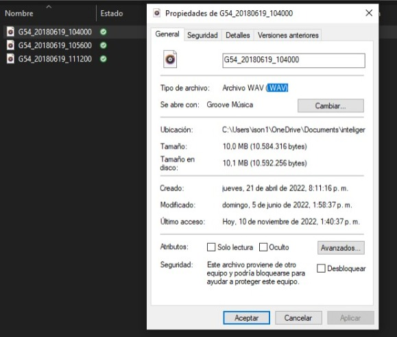
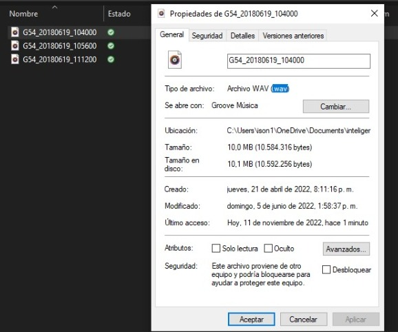
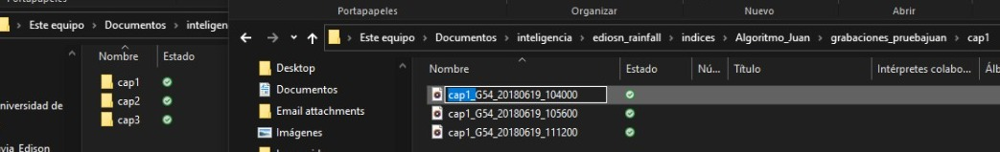
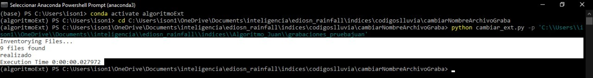

# Cambiar nombre y extensión de archivos .WAV

Este algoritmo desarroyado Python, modifica el nombre y la extensión de archivos .WAV. En principio, identifica todos los archivos de audio que se encuentran dentro de una misma carpeta. Después, cambia a todos los audios con extensión '.WAV' a '.wav', Como se ve en la siguente figura.


**Archivos de audio .WAV**   



**Archivos de audio modificado a .wav**       


Luego, le modifica el nombre a cada archivo .wav, agregando un prefijo, correspondiente a la carpeta al que pertenece el audio, como se ve en la siguente figura.

**Agregando prefijo a los archivos de audio .wav**



**Como utilizar este algoritmo desarroyado en Python?**

Desde la terminal de anaconda, ejecutamos la siguiente instrucción de codigo, para crear una variable de entorno de python llamada ***algoritmoExt***


```python

(base) PS C:\Users\ison1> conda create --name algoritmoExt python=3.10.6

```

Lluego activamos, la variable de entorno ***algoritmoExt*** mediante la siguente instrucción

```python
(base) PS C:\Users\ison1> conda activate algoritmoExt
```

Finalmente, nos ubicamos en la ruta donde se encuentra el archivo ***cambiar_ext.py***, el cual contiene el algoritmo que deseamos utilizar

```python
(algoritmoExt) PS C:\Users\ison1> cd C:\Users\ison1\OneDrive\Documents\inteligencia\ediosn_rainfall\indices\codigoslluvia\cambiarNombreArchivoGraba
```

Una vez, estamos en la ruta donde se encuentra el archivo ***cambiar_ext.py***, ejecutamos el comando ***python cambiar_ext.py -p 'path'***. Donde el ***path***, es la ruta donde se encuentran las carpectas que contienen los audios .WAV que se desean modificar.

```python
(algoritmoExt) PS C:\Users\ison1\OneDrive\Documents\inteligencia\ediosn_rainfall\indices\codigoslluvia\cambiarNombreArchivoGraba> python cambiar_ext.py -p 'path'
```

En la siguiente imagen, se ve un ejemplo de como se debe correr el programa. Las lineas que estan subrayas en blanco, es lo que debe aparecer despues de ejecutar el algoritmo. Donde vemos, el numero de archivos modificados (en este caso 9 archivos) y al final, el tiempo que se demoro en realiza todas las modificaciones.

**Ejemplo**
